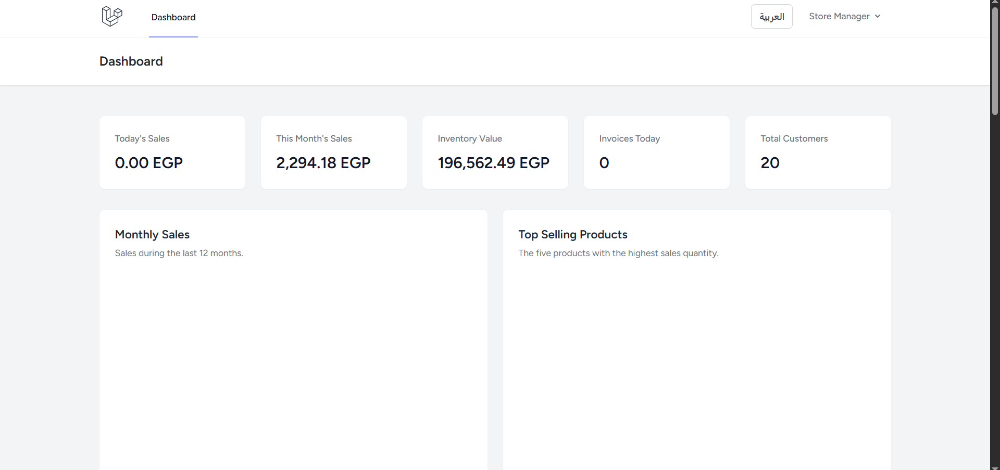

# Sales & Inventory Management System

A Laravel-based sales and inventory management system for managing products, customers, suppliers, sales and purchase invoices, product returns, payments, reports, stock movements, and business analytics.

The application includes role-based access control, English and Arabic localization, persistent dark mode, global search, activity logging, queued notifications, scheduled reporting, CSV import/export, and concurrency-safe stock operations.

## Features

### Authentication and User Management

- Secure authentication and password reset.
- Role-based authorization for administrators, managers, and cashiers.
- User account activation and deactivation.
- User profile management.
- Restricted public registration.

### Product and Category Management

- Product and category management.
- Unique product SKU generation.
- Product images stored on the public disk.
- Search, filtering, and sorting.
- Cost and selling price validation.
- Product CSV import with complete validation before saving.
- Updating existing products through matching SKUs.
- Downloadable sample CSV files.
- Automatic rollback when any imported row is invalid.

### Customer and Supplier Management

- Customer and supplier management.
- Search and validation.
- Role-based access restrictions.
- Customer account statements.

### Inventory Management

- Stock adjustments with an auditable movement history.
- Polymorphic stock movement relationships.
- Transaction-based stock changes.
- Database row locking with `lockForUpdate()`.
- Protection against negative inventory.
- Concurrency-safe sales confirmation.
- Low-stock detection based on product reorder levels.
- Product return stock restoration.
- Immutable stock movement history.

### Sales and Purchase Invoices

- Separate sales and purchase invoice workflows.
- Sequential invoice numbers with configurable prefixes.
- Independent yearly invoice sequences.
- Draft, confirmed, partially paid, paid, and cancelled invoice states.
- Fixed and percentage discounts.
- Configurable tax calculations.
- Automatic stock updates when invoices are confirmed or cancelled.
- Printable invoices with company information.
- Server-side calculation of invoice totals.
- Original invoice item prices preserved for product returns.
- Sales invoices with existing product returns cannot be cancelled, preventing duplicate stock restoration.

### Product Returns

- Dedicated product return workflow linked to original sales invoices.
- Partial product returns.
- Multiple returns against the same invoice.
- Cumulative returned quantities cannot exceed quantities originally sold.
- Product return quantities automatically restore stock.
- Stock movements use a dedicated return movement type.
- Product returns are linked to stock movements through polymorphic relationships.
- Return subtotals use the original invoice item unit prices.
- Sequential return references such as `RET-2026-000001`.
- Return dates cannot be before the original invoice date.
- Future return dates are rejected.
- Product returns can only be created for eligible sales invoices.
- Completed product returns are immutable and cannot be edited or deleted.
- Product return creation is recorded in the activity log.
- Product return pages support Arabic localization and dark mode.

### Payments

- Partial and full invoice payments.
- Multiple payments per invoice.
- Protection against payments exceeding the remaining balance.
- Payment method validation.
- Payment references and notes.
- Automatic invoice payment status updates.

### Dashboard and Analytics

- Daily and monthly sales totals.
- Current inventory valuation.
- Daily invoice counts.
- Customer counts.
- Low-stock product alerts.
- Recent invoices.
- Monthly sales chart.
- Top-selling products chart.
- Sales by category chart.
- Sales versus purchases chart.
- Role-based visibility of purchase data.
- Cached dashboard statistics with automatic invalidation.

### Global Search

Authenticated users can search supported application resources from the navigation bar.

Search capabilities include:

- Product names and SKUs.
- Customer names and phone numbers.
- Supplier names and phone numbers.
- Invoice numbers.
- Authorization-aware results based on the current user's role.
- Result limits to keep search responses efficient.

### Activity Log

The application keeps an auditable activity history for important business actions, including:

- Invoice creation.
- Invoice confirmation.
- Invoice cancellation.
- Payment recording.
- Stock adjustments.
- Product return creation.

Activity descriptions are localized for supported languages where applicable.

### Reports and CSV Exports

- Sales reports.
- Purchase reports.
- Profit reports.
- Inventory reports.
- Customer statements.
- Date-range filtering.
- CSV exports with UTF-8 BOM support.
- Access restricted to authorized administrators and managers.

### Notifications and Scheduled Tasks

- Queued low-stock notifications for active administrators and managers.
- Duplicate notification protection.
- Daily low-stock inventory checks.
- Daily reports covering the previous day's sales, purchases, profit, and low-stock products.
- Scheduled commands configured to run daily at 08:00.

### Localization

- English and Arabic language support.
- Language selection persisted in the session.
- Right-to-left layout support for Arabic.
- Left-to-right layout support for English.
- Localized invoice states and stock movement labels.
- Localized Product Return pages and activity descriptions.

### Dark Mode

- Persistent dark mode support.
- Theme preference stored in the browser.
- Dark mode supported across authenticated application pages.
- Compatible with Arabic RTL and English LTR layouts.
- Light and dark theme controls are available from the navigation bar.

### Application Settings

- Administrator-only settings management.
- Company name, phone, address, and logo.
- Currency configuration.
- Tax rate configuration.
- Sales and purchase invoice prefixes.
- Low-stock threshold configuration.
- Cached settings with automatic cache invalidation.

## Technology Stack

- PHP 8.2 or later.
- Laravel.
- MySQL.
- Blade templates.
- Tailwind CSS.
- Alpine.js.
- Vite.
- Chart.js.
- Laravel database queues.
- PHPUnit.

## Requirements

Install the following before setting up the application:

- PHP 8.2 or later.
- Composer.
- Node.js and npm.
- MySQL.
- Required PHP database and Laravel extensions.

## Installation

### 1. Clone the Repository

```bash
git clone https://github.com/hebamohammed5590-sudo/sales-inventory.git
cd sales-inventory
```

### 2. Install PHP Dependencies

```bash
composer install
```

### 3. Create the Environment File

On Windows PowerShell:

```powershell
Copy-Item .env.example .env
```

On Linux or macOS:

```bash
cp .env.example .env
```

### 4. Generate the Application Key

```bash
php artisan key:generate
```

### 5. Configure the Environment

Update `.env` with your local database settings:

```dotenv
APP_NAME="Sales Inventory"
APP_ENV=local
APP_DEBUG=true
APP_URL=http://127.0.0.1:8000

APP_LOCALE=en
APP_FALLBACK_LOCALE=en

DB_CONNECTION=mysql
DB_HOST=127.0.0.1
DB_PORT=3306
DB_DATABASE=sales_inventory
DB_USERNAME=root
DB_PASSWORD=

QUEUE_CONNECTION=database
CACHE_STORE=database
SESSION_DRIVER=database
```

Set `DB_PASSWORD` according to your MySQL configuration.

Create the `sales_inventory` database before running migrations.

### 6. Run Database Migrations and Base Seeders

```bash
php artisan migrate --seed
```

The default database seeder creates:

- Demo administrator, manager, and cashier accounts.
- Default application settings.

### 7. Create the Public Storage Link

```bash
php artisan storage:link
```

### 8. Install Frontend Dependencies

```bash
npm install
```

### 9. Build Frontend Assets

```bash
npm run build
```

For frontend development:

```bash
npm run dev
```

On Windows, use `npm.cmd` if your PowerShell configuration requires it:

```powershell
npm.cmd install
npm.cmd run build
```

### 10. Start the Application

```bash
php artisan serve
```

The application will be available at:

```text
http://127.0.0.1:8000
```

## Demo Accounts

| Role | Email | Password |
| --- | --- | --- |
| Administrator | admin@example.com | password |
| Manager | manager@example.com | password |
| Cashier | cashier@example.com | password |

These credentials are intended for local development only. Change them before deploying the application.

## Demo Business Data

To generate demo categories, products, customers, and suppliers:

```bash
php artisan db:seed --class=DemoDataSeeder
```

To generate demo purchase invoices, sales invoices, payments, and stock movements:

```bash
php artisan db:seed --class=TransactionDemoSeeder
```

Run `DemoDataSeeder` before `TransactionDemoSeeder`.

The transaction seeder generates:

- 40 demo purchase invoices.
- 120 demo sales invoices.
- Related invoice payments.
- Related inventory movements.

Existing application data can affect the final record counts.

## Queue Worker

Notifications use the configured queue connection.

Start the queue worker in a separate terminal:

```bash
php artisan queue:work
```

With `QUEUE_CONNECTION=database`, queued notifications remain pending until a queue worker processes them.

To inspect failed jobs:

```bash
php artisan queue:failed
```

To retry failed jobs:

```bash
php artisan queue:retry all
```

## Task Scheduler

The application schedules two daily commands at 08:00:

```text
inventory:check-low-stock
inventory:daily-report
```

List scheduled tasks:

```bash
php artisan schedule:list
```

Start the scheduler locally in a separate terminal:

```bash
php artisan schedule:work
```

Run commands manually:

```bash
php artisan inventory:check-low-stock
php artisan inventory:daily-report
```

For production, configure the operating system to execute the following command every minute:

```bash
php artisan schedule:run
```

On Windows, this can be configured through Windows Task Scheduler.

On Linux, a cron entry can be used:

```cron
* * * * * cd /path/to/sales-inventory && php artisan schedule:run >> /dev/null 2>&1
```

## Invoice State Transitions

| Current status | Allowed next status |
| --- | --- |
| `draft` | `confirmed`, `cancelled` |
| `confirmed` | `partially_paid`, `paid`, `cancelled` |
| `partially_paid` | `paid`, `cancelled` |
| `paid` | None |
| `cancelled` | None |

Invalid transitions are rejected.

A sales invoice that already has one or more product returns cannot be cancelled, even when its normal state transition would otherwise allow cancellation.

## Product Returns Workflow

Product returns are separate business documents linked to their original sales invoices.

Eligible source invoices must:

- Be sales invoices.
- Be in `confirmed`, `partially_paid`, or `paid` status.
- Contain at least one quantity that has not already been fully returned.

For every returned invoice item:

```text
remaining returnable quantity
=
original sold quantity
-
total quantity previously returned
```

A requested return quantity cannot exceed the remaining returnable quantity.

Return creation is executed inside a database transaction. Relevant invoice records are locked to protect inventory and cumulative return quantities from concurrent changes.

Return stock movements increase inventory and reference the Product Return document as their source.

Product returns currently represent stock/document operations. They do not automatically create financial refund payments.

## Product CSV Import

Administrators and managers can import products from the products page.

The application provides a downloadable sample CSV template.

Import behavior includes:

- Creating products with previously unknown SKUs.
- Updating products with existing SKUs.
- Validating every row before committing changes.
- Reporting validation errors with their corresponding CSV row numbers.
- Rejecting duplicate SKUs within the same file.
- Rejecting unknown categories.
- Rejecting selling prices lower than cost prices.
- Rejecting direct stock quantity imports.
- Supporting UTF-8 CSV files with or without a BOM.

Stock quantities must be changed through supported stock movements, stock adjustments, invoice confirmation, invoice cancellation, or product returns.

## Reports

Available report pages include:

```text
/reports
/reports/sales
/reports/purchases
/reports/profit
/reports/stock
/reports/customers/{customer}
```

Available CSV export endpoints include:

```text
/reports/sales/export
/reports/purchases/export
/reports/profit/export
/reports/stock/export
/reports/customers/{customer}/export
```

Reports and exports are restricted to authorized roles.

## Localization

The application supports:

```text
en — English
ar — Arabic
```

The selected language is stored in the user session.

Arabic pages render with right-to-left direction:

```html
<html lang="ar" dir="rtl">
```

English pages render with left-to-right direction:

```html
<html lang="en" dir="ltr">
```

## Running Tests

Run the complete automated test suite:

```bash
php artisan test
```

Important targeted test suites include:

```bash
php artisan test tests/Feature/ProductReturnServiceTest.php
php artisan test tests/Feature/ProductReturnWebTest.php
php artisan test tests/Feature/ProductReturnPolicyTest.php
php artisan test tests/Feature/InvoiceServiceTest.php
php artisan test tests/Feature/PaymentWebTest.php
php artisan test tests/Feature/LocalizationTest.php
php artisan test tests/Feature/DarkModeTest.php
php artisan test tests/Feature/GlobalSearchTest.php
php artisan test tests/Feature/ActivityLogTest.php
php artisan test tests/Feature/ProductCsvImportTest.php
php artisan test tests/Feature/SettingsWebTest.php
php artisan test tests/Feature/DailyReportCommandTest.php
php artisan test tests/Feature/QueuedNotificationTest.php
php artisan test tests/Feature/ConcurrentSalesTest.php
php artisan test tests/Feature/InvoiceStateMachineTest.php
```

The regular automated tests use the PHPUnit testing database configuration.

### Product Return Test Coverage

Product Return automated coverage includes:

- Partial stock restoration.
- Multiple partial returns.
- Over-return rejection.
- Fully returned item rejection.
- Invalid invoice type and status rejection.
- Original invoice price preservation.
- Product return number generation.
- Stock movement creation and source linkage.
- Activity log recording.
- HTTP create and store workflow.
- Guest authorization.
- Manager and cashier access.
- Product Return policy permissions.
- Immutable update/delete behavior.
- Return-date validation.
- Invoice cancellation protection after a return.

## Code Quality Checks

Run Laravel Pint:

```bash
vendor/bin/pint --test
```

On Windows PowerShell:

```powershell
vendor\bin\pint --test
```

Build production frontend assets:

```bash
npm run build
```

Check Git whitespace errors:

```bash
git diff --check
```

A recommended final verification sequence is:

```bash
php artisan test
vendor/bin/pint --test
npm run build
git diff --check
```

## MySQL Concurrency Test

The real concurrency test uses a dedicated MySQL database:

```text
sales_inventory_concurrency_test
```

This database is separate from the primary application database.

Create the database using MySQL:

```sql
CREATE DATABASE IF NOT EXISTS sales_inventory_concurrency_test;
```

Run migrations against the dedicated `concurrency` connection:

```bash
php artisan migrate --database=concurrency
```

Run the concurrency test:

```bash
php artisan test tests/Feature/ConcurrentSalesTest.php
```

The test verifies that concurrent sales cannot oversell available inventory and that product quantities never become negative.

Ensure the dedicated connection is configured in `config/database.php` before running this test.

## Useful Maintenance Commands

Clear cached application files:

```bash
php artisan optimize:clear
```

Inspect application routes:

```bash
php artisan route:list
```

Inspect invoice routes:

```bash
php artisan route:list --path=invoices
```

Inspect Product Return routes:

```bash
php artisan route:list --name=product-returns
```

Inspect report routes:

```bash
php artisan route:list --path=reports
```

Inspect settings routes:

```bash
php artisan route:list --path=settings
```

Inspect migrations:

```bash
php artisan migrate:status
```

## Security and Data Integrity Notes

- Never commit the `.env` file or production credentials.
- Disable debug mode in production.
- Change all demo account passwords before deployment.
- Restrict administrator accounts to trusted users.
- Run a queue worker to process queued notifications.
- Configure the scheduler for production deployments.
- Keep the concurrency testing database separate from production data.
- Stock mutations are performed through controlled application services.
- Product Return quantities are validated against cumulative previous returns.
- Product Returns cannot be modified or deleted after creation.
- Sales invoices with Product Returns cannot be cancelled.

## Repository

GitHub repository:

```text
https://github.com/hebamohammed5590-sudo/sales-inventory
```

## License

This project is built with the Laravel framework.

## Dashboard Screenshot

